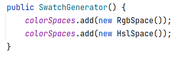
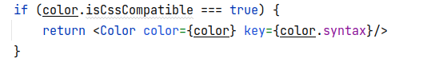

# Swatch generator

---

## Pre-requisites
* JDK 11
* Maven 3.8.4
* NodeJs 16.13.1

## How to run

### 1. Using binary 

* Clone `swatch-server` and `swatch-ui` modules using following commands,
  * `git clone git@github.com:Random-Swatch/swatch-server.git`
  * `git clone git@github.com:Random-Swatch/swatch-ui.git`
* Navigate to the root of the `swatch-server` module and run the following command,
  * `mvn spring-boot:run`
* Navigate to the root of the `swatch-ui` module and run following commands,
  * `npm install`
  * `npm start`
* Press `ctrl + c` to terminate.

### 2. Using Docker

* Run `./run.sh` script to start.
* Run `./stop.sh` script to stop.

## How to use

* Open the URL `http://localhost:3000` in a web browser and click on the `GENERATE SWATCH` button.


## Swatch API

* Method: `GET`
* URL: `http://localhost:8080/swatch`
* Response data:
```json
[

  {
    "type":"HSL",
    "syntax":"hsl(164, 75%, 93%)",
    "isCssCompatible":true
  },
  {
    "type":"HSL",
    "syntax":"hsl(29, 88%, 33%)",
    "isCssCompatible":true
  },
  {
    "type":"HSL",
    "syntax":"hsl(121, 72%, 69%)",
    "isCssCompatible":true
  },
  {
    "type":"RGB",
    "syntax":"rgb(161, 25, 95)",
    "isCssCompatible":true
  },
  {
    "type":"RGB",
    "syntax":"rgb(65, 116, 179)",
    "isCssCompatible":true
  }

]
```

## How to add a new color space

### `swatch-server` update
* Define the space type of the new color space in `com.kanopi.swatch.ColorSpaceType` enum class.
* Create a new class for the new color space and implement the `com.kanopi.swatch.Color` interface.
  * `ColorSpaceType getType();` ~ This method returns the color space type.
  * `Color random();` ~ This method should generate a random color from the space.
  * `String getSyntax();` ~ This method should return the syntax to use the color in Web UI.
  * `boolean getIsCssCompatible();` ~ This method should return the CSS compatibility status of the color space. Ex: If the color space is compatible with the latest CSS version this value should be `true` else, should be `false`.
  * For a sample implementation check the `com.kanopi.swatch.RgbSpace` class.
* Create a new Object of the class and add to the `colorSpaces` list which is defined in the `com.kanopi.swatch.SwatchGenerator` class. 
* Default color spaces has been added inside the constructor of the `com.kanopi.swatch.SwatchGenerator` class. Add a new line at the same place to add the new Color space to the list.



### `swatch-ui` update

* If the newly added color space supports the latest CSS version and can render in the browser, then no change requires in the `swatch-ui`.
* But,
  * If it doesn't support need to create a color component similar to `src/components/Color.js` with a custom implementation to render the color in the UI.
  * Then add the component in `src/components/Swatch.js` file and update the following condition accordingly.
    
