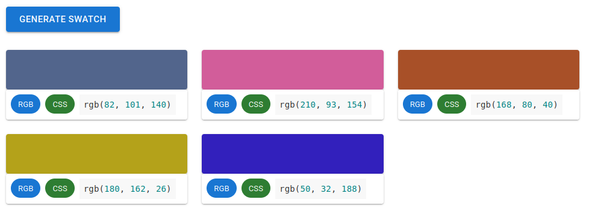

# Swatch generator

---

## Pre-requisites
* JDK 11
* Maven 3.8.4
* NodeJs 16.13.1

## How to run

### 1. Using binary 

* Clone `swatch-server` and `swatch-ui` modules using following commands,
  * `git clone git@github.com:Random-Swatch/swatch-server.git`
  * `git clone git@github.com:Random-Swatch/swatch-ui.git`
* Navigate to the root of the `swatch-server` module and run the following command,
  * `mvn spring-boot:run`
* Navigate to the root of the `swatch-ui` module and run following commands,
  * `npm install`
  * `npm start`

### 2. Using Docker

* Run `./run.sh` script.

## How to use

* Open the URL `http://localhost:3000` in a web browser.

* Click on the `GENERATE SWATCH` button.

